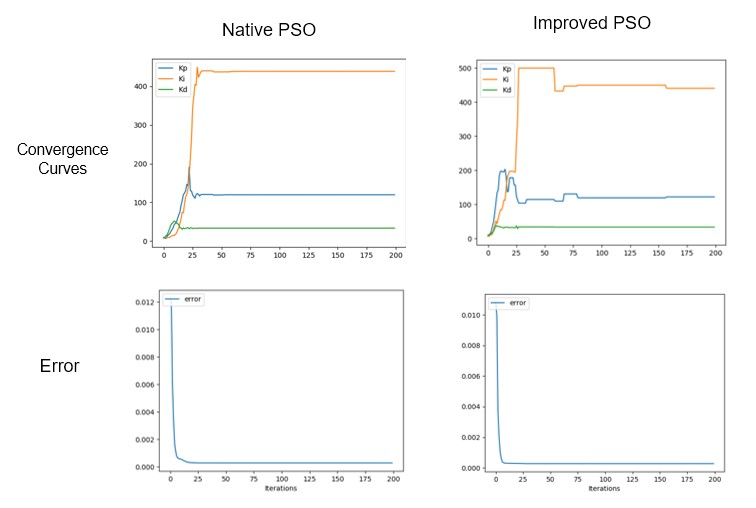
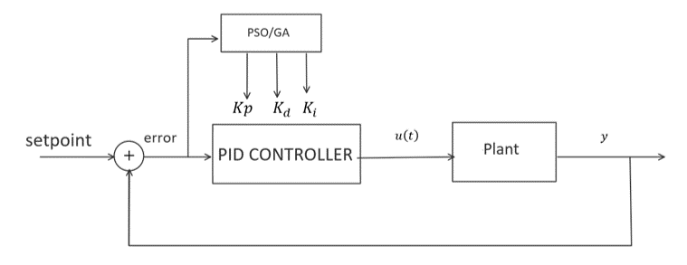
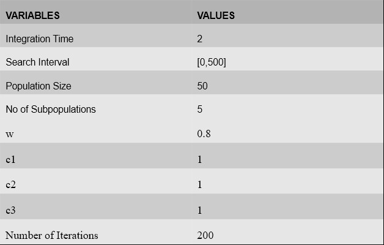

## PID Tuning of nonlinear systems using PSO
This repository contains code for the project for Optimization Techniques(ME866).

Reference paper: Chang, Wei-Der & Shih, Shun-Peng. (2010). PID controller design of nonlinear systems using an improved particle swarm optimization approach. Communications in Nonlinear Science and Numerical Simulation - COMMUN NONLINEAR SCI NUMER SI. 15. 3632-3639. 10.1016/j.cnsns.2010.01.005. 

### Performance Comparison:

### System Flowchart:

### Improved PSO params:

